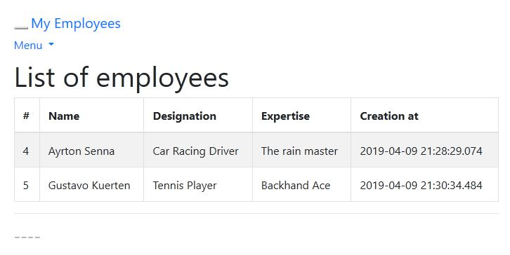

# SpringBoot-Rest-JPA-Hibernate
Sample of a CRUD application using Spring Boot + Spring MVC + Restful API + JPA / Hibernate 

The original tutorial for this sample is available on [Youtube](https://www.youtube.com/watch?v=DCZOchCX10s) and at [author´s github](https://github.com/varuncbv/SpringBootRestAPIHibernateJPAMYSQLTutorial/), the sample in this repository has some changes to make it up to date with:

- OracleXE or SQLServer 
- Hirakari Connection Pool 3.3.1
- Spring Boot 2.13
- [Thymeleaf](https://www.mkyong.com/spring-boot/spring-boot-hello-world-example-thymeleaf/) [[pt-br tutorial](https://blog.algaworks.com/thymeleaf/)]

Further explanation on JPA annotation present in this sample can be found on [Spring Guides](https://github.com/spring-guides/gs-accessing-data-jpa).  The [MKyound Spring Boot example](https://www.mkyong.com/spring-boot/spring-boot-spring-data-jpa-oracle-example/) also give more tips of the implementation. 

## Screenshot

- URL: http://localhost:8181/company  



## Useful Tools 

- [Postman](https://www.getpostman.com/downloads/) or [Insomnia](https://insomnia.rest)

## Snippets

###  Create Oracle User

```
create user exampledb identified by pwd123 default tablespace users quota unlimited ON users temporary tablespace temp;
grant connect, create session, imp_full_database to exampledb;
grant analyze any to exampledb;
GRANT DBA TO exampledb;
```

## REST API

### LIST ALL
- GET http://{ur}:{port}/company/employees

### LIST by id

- http://{url}:{port}/company/employees/{id}

### UPDATE

- PUT  http://{ur}:{port}/company/employees/{id} + JSON BODY

### DELETE

- DELETE  http://{ur}:{port}/company/employees/{id}

### CREATE

- POST  http://{ur}:{port}/company/employees
- Options to choose on postman: POST / raw / JSON (application/json)

````
{
    "name": "Ayrton Senna",
    "designation": "Car Racing Driver",
    "expertise": "The rain master"
}
````


